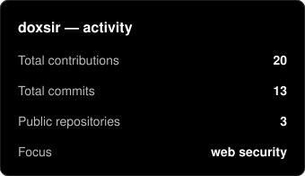
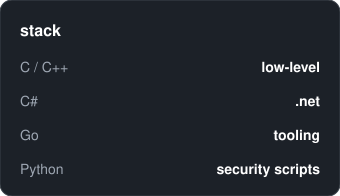

<div align="center">


<a href="https://standoff365.com/profile/poopguy/">
  
</a>

```
$ whoami
doxsir — software dev gone offensive security.
$ cat focus.txt
web security · recon · bug bounty · documented in public
$ uptime
learning since day one, no plans to stop
```

</div>

## 🎯 What's this

Software dev background (C/C++ low-level, C#, Go, Python), now learning to break things instead of building them. Everything I learn goes here: labs, writeups, tooling.

**Where I play:** [Standoff365](https://standoff365.com/profile/poopguy/) · PortSwigger Academy · TryHackMe

## 🧰 Arsenal


## 🚀 Projects

| | |
|---|---|
| **[web-recon-toolkit](https://github.com/doxsir/web-recon-toolkit)** | Passive subdomain enumeration via CT logs. What I actually run during recon |
| **[labs-writeups](https://github.com/doxsir/labs-writeups)** | Lab & CTF writeups — root cause first, payload second |

## 📊 Stats

<div align="center">
  &nbsp;&nbsp;&nbsp;
  
  <br/><br/>
  
  <br/><br/>
  
</div>

## 📜 Rules I play by

> Test only what you're authorized to test. Document everything. Report responsibly.

---

<div align="center">
  <a href="https://standoff365.com/profile/poopguy/"></a>
  
</div>


